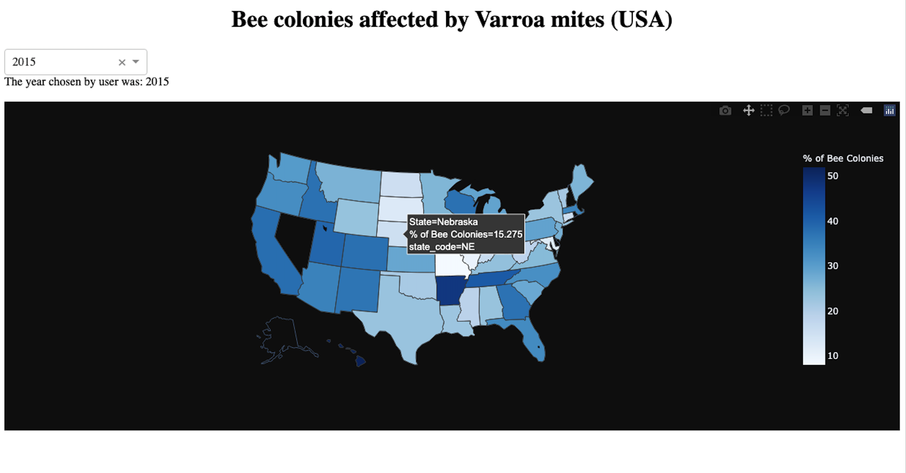

Dashboard showing bee colonies affected by Varroa mites (2015-2018, USA)

This dashboard shows the percentage of bee colonies affected in each state within the US from 2015 - 2018. With the use of a dropdown Dash component the user can select the year of interest (2015, 2016, 2017 or 2018). The data can be interepreted at first glance with the use of the legend which uses a gradient to show percentage of bee colonies affected ranging from the lower limit of  0% (white) to the upper limit of 50% (navy blue)

- Python
- Pandas
- Plotly
- Dash

Updated: 10/2020
